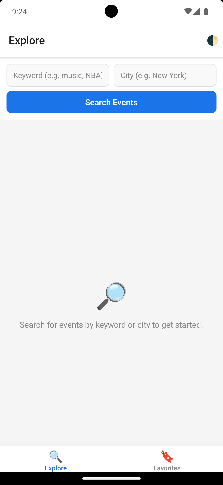
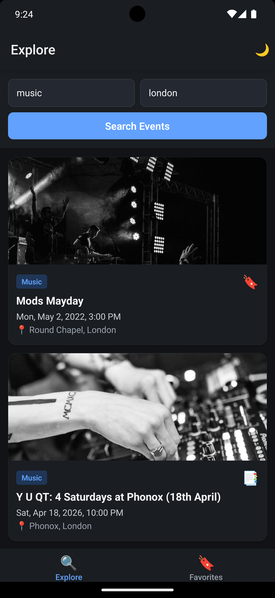
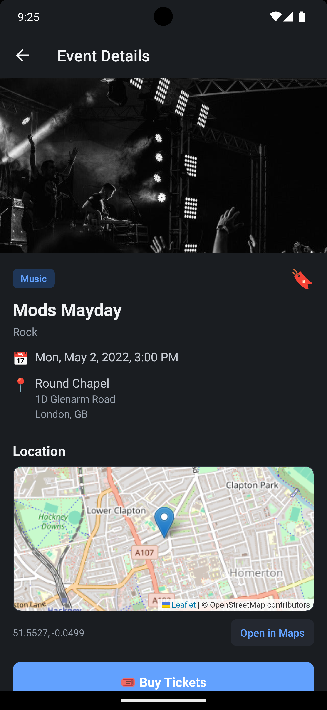

# Mini Event List App

Ticketmaster event discovery app built with React Native.

## Full Setup Guide

### 1) Prerequisites

Before running this project, install and verify:

- Node.js 18+
- npm 10+
- React Native development setup (Android Studio + SDK, Xcode, CocoaPods)

Reference: https://reactnative.dev/docs/set-up-your-environment

### 2) Install dependencies

From project root:

```sh
npm install
```

For iOS native dependencies:

```sh
cd ios
bundle install
bundle exec pod install
cd ..
```

### 3) Environment variables

Create local env file:

```sh
cp .env.example .env
```

Set your Ticketmaster API key in .env:

```env
TM_API_KEY=your_ticketmaster_discovery_api_key_here
```

Note: Embedded map uses OpenStreetMap tiles through WebView, so no Google Maps key is required.

### 4) Run the app

Start Metro:

```sh
npm start
```

Run Android (new terminal):

```sh
npm run android
```

Run iOS (new terminal):

```sh
npm run ios
```

### 5) Type-check

```sh
npx tsc --noEmit --strict --skipLibCheck
```

### 6) Common troubleshooting

- If native modules are not detected on iOS:

```sh
cd ios && bundle exec pod install
```

- If Metro cache causes stale behavior:

```sh
npm start -- --reset-cache
```

- If Android build keeps old native state:

```sh
cd android && ./gradlew clean
```

## Key Decisions Made During Build

### Stack and Architecture

- React Native 0.79 + TypeScript for mobile app foundation.
- React Navigation with root stack + bottom tabs.
- Redux Toolkit + RTK Query for predictable state + API fetching.
- MMKV for fast local persistence (favorites and theme mode).

### API Layer

- Ticketmaster Discovery API integration via RTK Query.
- Pagination merged in cache for infinite-scroll style event loading.
- Central API logger interceptor added for request/response visibility.
- API key moved to environment-based config (no hardcoded runtime secret in source).

### Feature Decisions

- Favorites implemented as normalized state (items + id lookup) and persisted via MMKV.
- Theme system implemented with light/dark modes and in-app toggle.
- Theme choice persists (system/light/dark cycle).

### Map Decision

- Initial Google Maps integration was replaced.
- Final map implementation uses OpenStreetMap tiles inside WebView (Leaflet), allowing free test usage without Google billing/API key setup.
- Map remains reusable via dedicated VenueMap component.

### UX Decisions

- Reusable UI components for search, cards, loading, empty, and error states.
- Event details include location, pricing, external ticket link, and map section.
- Open in Maps action preserved for platform-native navigation.

## Screenshots

### 1) Landing Screen

Shows the initial app view with search inputs and quick entry point for exploring events.



### 2) Events List Screen

Displays fetched events in card format with key details and bookmark actions.



### 3) Event Details Screen

Shows full event information including venue details, map section, and ticket action.


